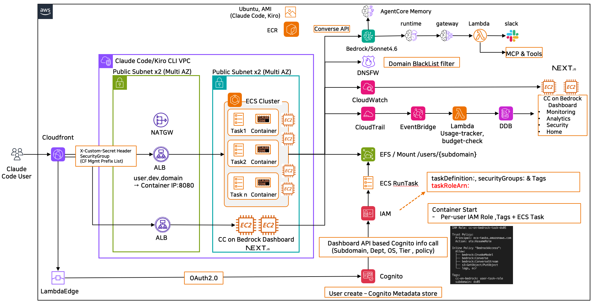
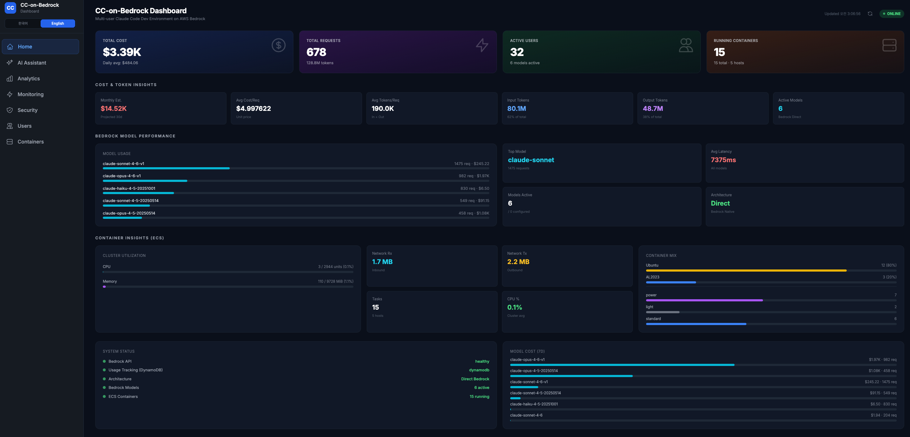
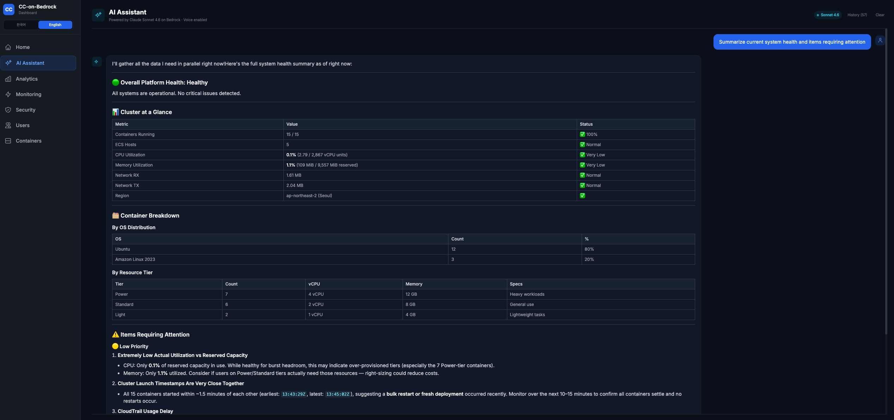
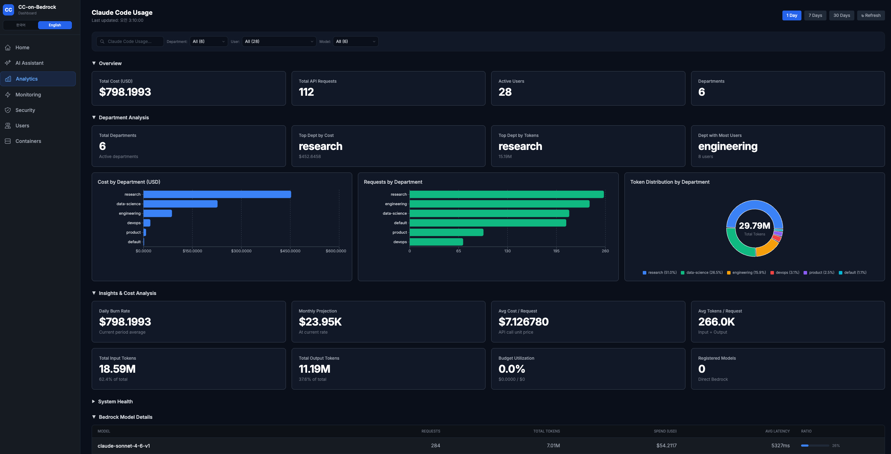
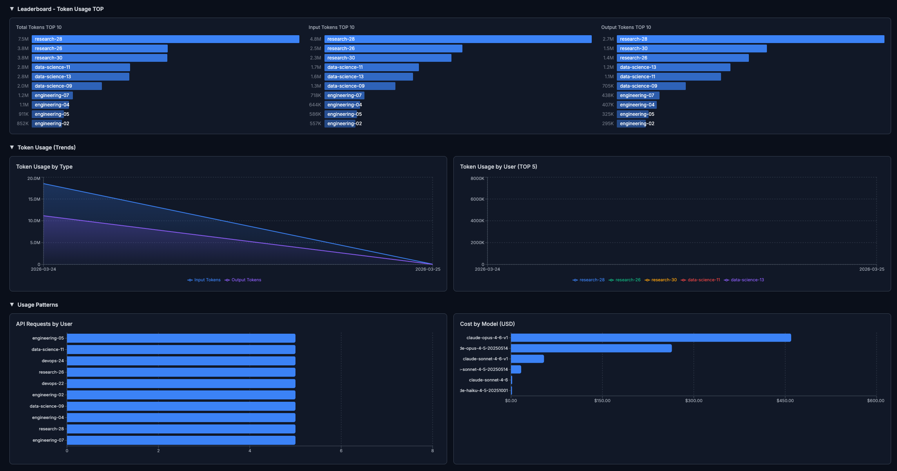
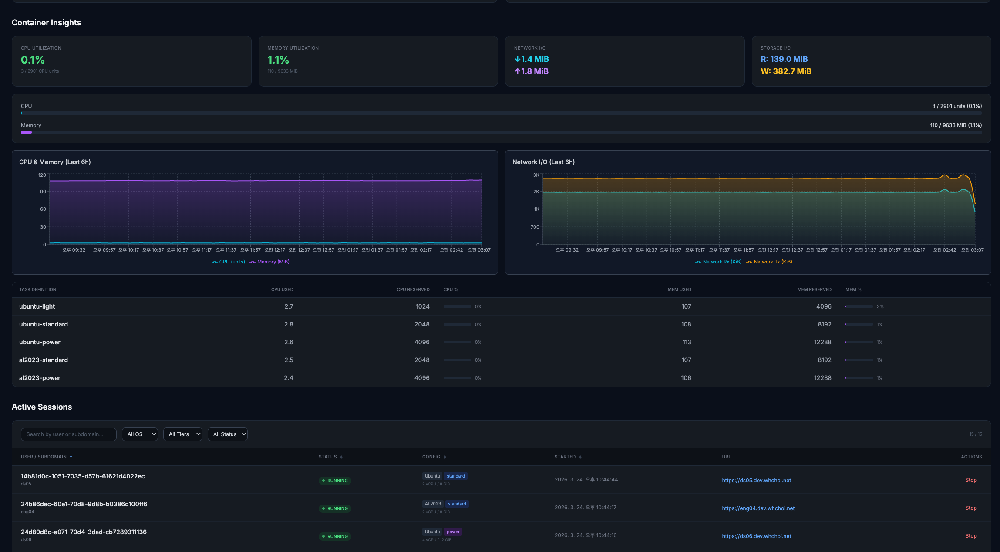
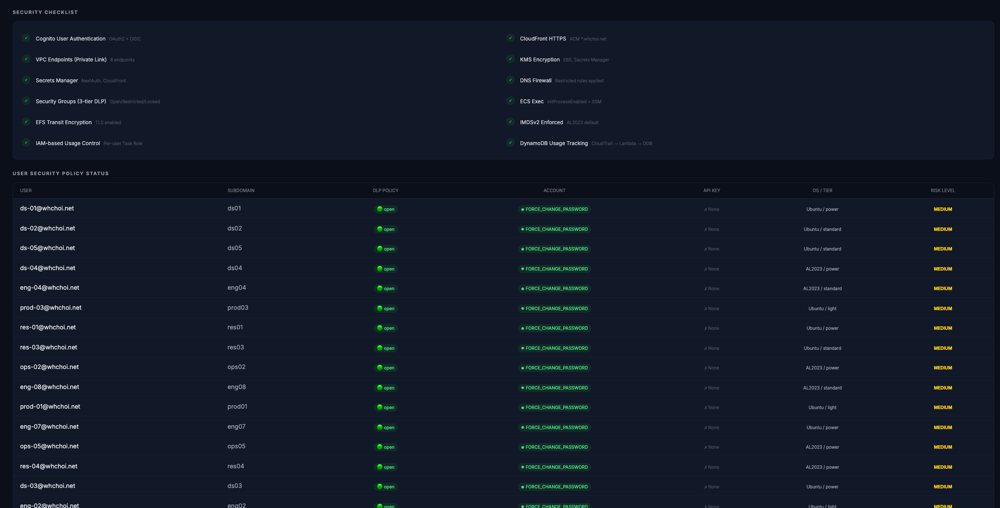
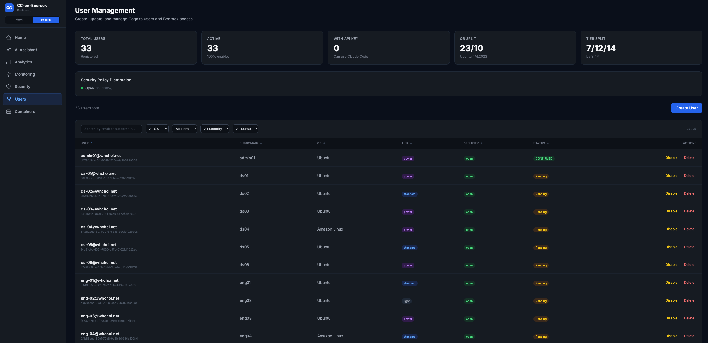
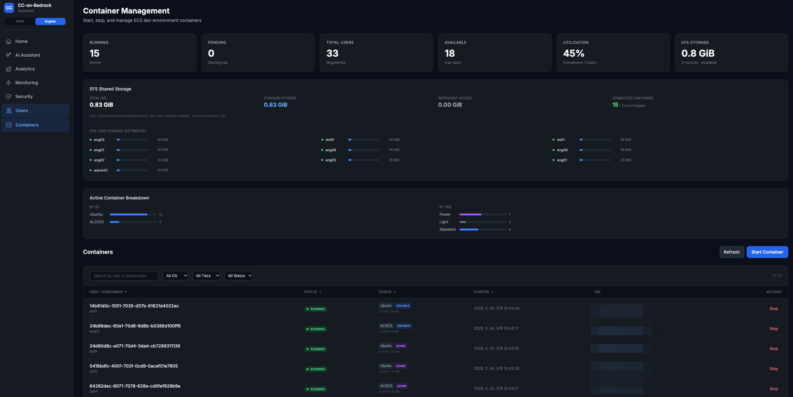

> **Language / 언어**: [English](#en) | [한국어](#ko)

---

<a id="en"></a>

# CC-on-Bedrock

**Multi-user Claude Code Development Platform on AWS Bedrock**

A fully managed, multi-user development platform that provides each developer with an isolated Claude Code + Kiro environment on a dedicated EC2 instance (ARM64), with centralized management through a Next.js dashboard. Infrastructure is implemented in three IaC tools: CDK (TypeScript), Terraform (HCL), and CloudFormation (YAML).

## Architecture



### Key Design Principles

- **Bedrock Direct Mode** — Claude Code calls Bedrock directly via ECS Task Role (no proxy)
- **Per-user IAM Roles** — Individual budget control with dynamic IAM Deny Policy
- **Hybrid AI** — Dashboard uses Converse API (fast streaming), Slack uses AgentCore Runtime (shared)
- **7-Layer Security** — CloudFront → ALB → Cognito → Security Groups → VPC Endpoints → DNS Firewall → IAM/DLP
- **Serverless Tracking** — CloudTrail → EventBridge → Lambda → DynamoDB (~$5/month vs $370 with LiteLLM)

### Infrastructure Stacks (7)

| Stack | Resources |
|-------|-----------|
| **01-Network** | VPC (10.100.0.0/16), Public/Private Subnets (2 AZ), NAT Gateway x2, VPC Endpoints x8, DNS Firewall |
| **02-Security** | Cognito (Hosted UI + OAuth 2.0), ACM, KMS, Secrets Manager, IAM Roles, SNS |
| **03-Usage Tracking** | DynamoDB, Lambda (usage-tracker + budget-check + gateway-manager), EventBridge, CloudTrail, MCP Catalog/Config tables |
| **04-ECS DevEnv** | ECS Cluster, NLB + Nginx, DynamoDB Routing Table |
| **05-Dashboard** | Dashboard ECS Ec2Service, ALB, Unified CloudFront (Dashboard + DevEnv), Lambda@Edge |
| **06-WAF** | WAF WebACL (CloudFront, ALB) |
| **07-EC2 DevEnv** | EC2-per-user DevEnv: Launch Template, DLP SG, IAM Role, Instance Profile, DynamoDB (cc-user-instances) |

### AgentCore (Outside CDK)

| Resource | ID | Purpose |
|----------|-----|---------|
| **Runtime** | cconbedrock_assistant_v2 | Strands Agent (PUBLIC mode) |
| **Gateway** | cconbedrock-gateway | MCP protocol, 3 Lambda targets |
| **Memory** | cconbedrock_memory | Per-user conversation history |
| **Lambda Tools** | 3 functions, 8 MCP tools | ECS, CloudWatch, DynamoDB |

## AI Assistant — Hybrid Architecture

```
Dashboard (fast, real-time streaming):
  Browser → /api/ai → Bedrock Converse API (direct)
  → Token-level SSE streaming, 1~5 sec, 3 inline tools

Slack/External (shared, multi-client):
  Slack Bot → /api/ai/runtime → AgentCore Runtime → Gateway (MCP) → Lambda
  → Full response after processing, 10~20 sec, 8 tools

Both share: AgentCore Memory (per-user session isolation)
```

## Container Architecture

Each user gets:
- **1 ECS Task** — Isolated container (code-server + Claude Code + Kiro)
- **1 ENI** — Unique Private IP (awsvpc network mode)
- **1 IAM Role** — Per-user (`cc-on-bedrock-task-{subdomain}`) for budget control
- **1 ALB Target Group** — Host-based routing (`{subdomain}.dev.whchoi.net`)
- **1 EFS Directory** — Per-user isolation (`/users/{subdomain}/`)

### Task Definition Specifications

| Task Definition | OS | vCPU | Memory | Use Case |
|----------------|-----|------|--------|----------|
| devenv-ubuntu-light | Ubuntu 24.04 | 1 | 4 GiB | Lightweight, docs |
| devenv-ubuntu-standard | Ubuntu 24.04 | 2 | 8 GiB | General dev (default) |
| devenv-ubuntu-power | Ubuntu 24.04 | 4 | 12 GiB | Large builds, ML |
| devenv-al2023-light | Amazon Linux 2023 | 1 | 4 GiB | AWS-native lightweight |
| devenv-al2023-standard | Amazon Linux 2023 | 2 | 8 GiB | AWS-native general |
| devenv-al2023-power | Amazon Linux 2023 | 4 | 12 GiB | AWS-native large |

## Security — 7 Layers

| Layer | Component | Protection |
|-------|-----------|------------|
| L1 | CloudFront | HTTPS (TLS 1.2+), AWS Shield DDoS |
| L2 | ALB | CloudFront Prefix List + X-Custom-Secret header |
| L3 | Cognito | OAuth 2.0, admin/user group-based access |
| L4 | Security Groups | 3-tier DLP (Open / Restricted / Locked) |
| L5 | VPC Endpoints | Private Link (no internet transit) |
| L6 | DNS Firewall | 5 AWS threat lists + custom block |
| L7 | IAM + DLP | Per-model access control, budget Deny Policy, file restrictions |

## Budget Control Flow

```
ECS Task (Claude Code) → Bedrock API call
  → CloudTrail (auto-logged)
  → EventBridge Rule (match bedrock:InvokeModel)
  → Lambda: usage-tracker → DynamoDB (per-user cost)

Every 5 min: Lambda: budget-check
  → DynamoDB Scan (today's cost per user)
  → 80%: SNS warning alert
  → 100%: IAM Deny Policy on user's Task Role + Cognito flag
  → Next day: auto-release Deny Policy
```

## Dashboard (9 Pages)

| Page | Access | Features |
|------|--------|----------|
| Home | All | Cost/token/user summary, cluster metrics |
| **My Environment** | All | **3-tab user portal** — environment, storage, settings (see below) |
| AI Assistant | All | Bedrock Converse + Tool Use, AgentCore Memory, copy, voice |
| Analytics | All | Model/department/user cost trends, leaderboard |
| Department | Manager | Department member management, budget, usage, pending approvals |
| Monitoring | Admin | Container Insights (CPU/Memory/Network), ECS status |
| Security | Admin | IAM, DLP, DNS Firewall, CloudTrail audit, checklist |
| Users | Admin | Cognito CRUD, sort/filter (OS, Tier, Security, Status) |
| Containers | Admin | ECS start/stop, sort/filter, EFS panel, duplicate prevention |

### My Environment — User Self-Service Portal

Tab-based layout with three sections for self-service container management:

| Tab | Features |
|-----|----------|
| **Environment** | SSE real-time provisioning progress (6 steps), container status, VSCode URL (copy), tier selection, CPU/Memory metrics, daily token usage |
| **Storage** | Disk usage gauge (EBS: capacity %, EFS: usage only), EBS volume expansion request (40/60/100 GB), request status/cancel, Keep-Alive |
| **Settings** | Code-server password view/change (Cognito + Secrets Manager sync), account info (read-only) |

**Provisioning Flow (SSE Streaming)**
```
Start → Setting up permissions → Preparing storage → Configuring environment
     → Securing access → Starting container → Connecting network → Ready
```
Each step streams real-time status via Server-Sent Events (`/api/user/container/stream`).

**Password Sync Architecture**
```
User Creation:
  Admin creates user → TemporaryPassword → Cognito + Secrets Manager (both)

Password Change (Dashboard):
  User changes password → AdminSetUserPassword (Cognito)
                        → PutSecretValue (Secrets Manager)
                        → code-server uses new password on next start
```

**API Routes (User Self-Service)**

| Endpoint | Method | Purpose |
|----------|--------|---------|
| `/api/user/container` | POST | Start/stop container |
| `/api/user/container/stream` | POST | SSE provisioning progress |
| `/api/user/container-metrics` | GET | CloudWatch Container Insights |
| `/api/user/disk-usage` | GET | Disk capacity via CloudWatch |
| `/api/user/ebs-resize` | GET/POST/DELETE | EBS expansion request/status/cancel |
| `/api/user/password` | GET/POST | Password view/change |
| `/api/user/usage` | GET | Daily token usage |
| `/api/user/keep-alive` | POST | Extend idle timeout (EBS) |

**Accessibility**: ARIA tablist/tab/tabpanel roles, progressbar roles, keyboard arrow navigation, form label associations, aria-live alerts, responsive grid layouts.

### Screenshots

**Home** — Platform overview with cost, tokens, containers, and cluster metrics


**AI Assistant** — Conversational AI with Bedrock Converse API + Tool Use


**Analytics** — Cost trends, model usage, department breakdown, user leaderboard



**Monitoring** — Container Insights: CPU, Memory, Network, ECS status


**Security** — IAM policies, DLP status, DNS Firewall, security checklist


**Users** — Cognito user management with sort/filter


**Containers** — ECS container management with EFS panel


## Project Structure

```
docs/              Architecture, specs, plans, deployment guide
.claude/           Claude Code settings, hooks, skills
.kiro/             Kiro agent settings, steering docs
tools/             Scripts, prompts
docker/            Docker images (devenv Ubuntu/AL2023)
cdk/               AWS CDK TypeScript (5 active stacks)
terraform/         Terraform HCL (4 modules)
cloudformation/    CloudFormation YAML (4 templates) + deploy.sh
shared/nextjs-app/ Next.js dashboard (9 pages, 16 API routes)
agent/             AgentCore agent (Strands + MCP Gateway)
scripts/           ECR repos, deployment verification, test users
tests/             Container integration tests, E2E tests
output/            Architecture docs (bilingual ko/en)
img/               Architecture diagrams
```

## Quick Start

```bash
# CDK Deploy
cd cdk && npm install && npx cdk deploy --all

# Terraform Deploy
cd terraform && terraform init && terraform apply

# CloudFormation Deploy
cd cloudformation && bash deploy.sh

# Docker Images
cd docker && bash build.sh build all

# Dashboard Dev
cd shared/nextjs-app && npm install && npm run dev

# AgentCore Lambda + Gateway
ACCOUNT_ID=xxx python3 agent/lambda/create_targets.py
```

## Tech Stack

- **IaC**: AWS CDK v2, Terraform >= 1.5, CloudFormation
- **Container**: Docker (Ubuntu 24.04 / Amazon Linux 2023, ARM64)
- **Frontend**: Next.js 14+ (App Router), Tailwind CSS, Recharts
- **Auth**: Amazon Cognito (OAuth 2.0 + OIDC) + NextAuth.js
- **AI Models**: Bedrock Opus 4.6, Sonnet 4.6, Haiku 4.5
- **AI Framework**: Strands Agents, MCP Protocol, AgentCore Runtime/Gateway/Memory
- **Backend**: DynamoDB, Lambda, EventBridge, EFS, ECS (EC2 mode)
- **Networking**: CloudFront, ALB, VPC Endpoints, DNS Firewall, NAT Gateway
- **Security**: KMS, Secrets Manager, IAM (per-user roles), Security Groups (3-tier DLP)
- **Region**: ap-northeast-2 (Seoul)

---

<a id="ko"></a>

# CC-on-Bedrock

**AWS Bedrock 기반 멀티유저 Claude Code 개발환경 플랫폼**

개발자마다 격리된 Claude Code + Kiro 환경을 전용 EC2 인스턴스(ARM64)에서 제공하고, Next.js 대시보드로 중앙 관리하는 완전 관리형 멀티유저 개발 플랫폼입니다. CDK(TypeScript), Terraform(HCL), CloudFormation(YAML) 3가지 IaC로 동일 인프라를 구현합니다.

## 아키텍처


### 핵심 설계 원칙

- **Bedrock Direct Mode** — Claude Code가 ECS Task Role로 Bedrock 직접 호출 (프록시 없음)
- **사용자별 IAM Role** — 동적 IAM Deny Policy로 개별 예산 제어
- **하이브리드 AI** — Dashboard는 Converse API (빠른 스트리밍), Slack은 AgentCore Runtime (공유)
- **7계층 보안** — CloudFront → ALB → Cognito → Security Groups → VPC Endpoints → DNS Firewall → IAM/DLP
- **서버리스 추적** — CloudTrail → EventBridge → Lambda → DynamoDB (월 ~$5, LiteLLM 대비 $370 절감)

### 인프라 스택 (7개)

| 스택 | 리소스 |
|------|--------|
| **01-Network** | VPC (10.100.0.0/16), Public/Private Subnet (2 AZ), NAT Gateway x2, VPC Endpoint x8, DNS Firewall |
| **02-Security** | Cognito (Hosted UI + OAuth 2.0), ACM, KMS, Secrets Manager, IAM Roles, SNS |
| **03-Usage Tracking** | DynamoDB, Lambda (usage-tracker + budget-check + gateway-manager), EventBridge, CloudTrail, MCP Catalog/Config 테이블 |
| **04-ECS DevEnv** | ECS Cluster, NLB + Nginx, DynamoDB Routing Table |
| **05-Dashboard** | Dashboard ECS Ec2Service, ALB, Unified CloudFront (Dashboard + DevEnv), Lambda@Edge |
| **06-WAF** | WAF WebACL (CloudFront, ALB) |
| **07-EC2 DevEnv** | EC2-per-user DevEnv: Launch Template, DLP SG, IAM Role, Instance Profile, DynamoDB (cc-user-instances) |

### AgentCore (CDK 외부 관리)

| 리소스 | ID | 용도 |
|--------|-----|------|
| **Runtime** | cconbedrock_assistant_v2 | Strands Agent (PUBLIC 모드) |
| **Gateway** | cconbedrock-gateway | MCP 프로토콜, Lambda 타겟 3개 |
| **Memory** | cconbedrock_memory | 사용자별 대화 기억 |
| **Lambda Tools** | 3개 함수, 8개 MCP Tool | ECS, CloudWatch, DynamoDB |

## AI Assistant — 하이브리드 구조

```
Dashboard (빠른 실시간 스트리밍):
  Browser → /api/ai → Bedrock Converse API (직접)
  → 토큰 단위 SSE 스트리밍, 1~5초, 인라인 Tool 3개

Slack/외부 (멀티 클라이언트 공유):
  Slack Bot → /api/ai/runtime → AgentCore Runtime → Gateway (MCP) → Lambda
  → 전체 응답 후 반환, 10~20초, 8개 Tool

양쪽 공유: AgentCore Memory (사용자별 세션 격리)
```

## 컨테이너 구조

각 사용자에게 할당:
- **ECS Task 1개** — 격리된 컨테이너 (code-server + Claude Code + Kiro)
- **ENI 1개** — 고유 Private IP (awsvpc 네트워크 모드)
- **IAM Role 1개** — 사용자별 (`cc-on-bedrock-task-{subdomain}`) 예산 제어
- **ALB Target Group 1개** — Host 기반 라우팅 (`{subdomain}.dev.whchoi.net`)
- **EFS 디렉토리 1개** — 사용자별 격리 (`/users/{subdomain}/`)

### Task Definition 사양

| Task Definition | OS | vCPU | Memory | 용도 |
|----------------|-----|------|--------|------|
| devenv-ubuntu-light | Ubuntu 24.04 | 1 | 4 GiB | 경량 작업, 문서 |
| devenv-ubuntu-standard | Ubuntu 24.04 | 2 | 8 GiB | 일반 개발 (기본) |
| devenv-ubuntu-power | Ubuntu 24.04 | 4 | 12 GiB | 대규모 빌드, ML |
| devenv-al2023-light | Amazon Linux 2023 | 1 | 4 GiB | AWS 네이티브 경량 |
| devenv-al2023-standard | Amazon Linux 2023 | 2 | 8 GiB | AWS 네이티브 일반 |
| devenv-al2023-power | Amazon Linux 2023 | 4 | 12 GiB | AWS 네이티브 대규모 |

## 보안 — 7계층

| 계층 | 컴포넌트 | 보호 |
|------|----------|------|
| L1 | CloudFront | HTTPS (TLS 1.2+), AWS Shield DDoS 방어 |
| L2 | ALB | CloudFront Prefix List + X-Custom-Secret 헤더 검증 |
| L3 | Cognito | OAuth 2.0, admin/user 그룹 기반 접근 제어 |
| L4 | Security Groups | 3-tier DLP (Open / Restricted / Locked) |
| L5 | VPC Endpoints | Private Link (인터넷 경유 없음) |
| L6 | DNS Firewall | 5개 AWS 위협 리스트 + 커스텀 차단 |
| L7 | IAM + DLP | 모델별 접근 제어, 예산 Deny Policy, 파일 제한 |

## 예산 제어 흐름

```
ECS Task (Claude Code) → Bedrock API 호출
  → CloudTrail (자동 기록)
  → EventBridge Rule (bedrock:InvokeModel 매칭)
  → Lambda: usage-tracker → DynamoDB (사용자별 비용)

5분마다: Lambda: budget-check
  → DynamoDB Scan (오늘 사용자별 비용)
  → 80%: SNS 경고 알림
  → 100%: 사용자 Task Role에 IAM Deny Policy 부착 + Cognito 플래그
  → 다음 날: Deny Policy 자동 해제
```

## Dashboard (9 페이지)

| 페이지 | 접근 | 기능 |
|--------|------|------|
| Home | 전체 | 비용/토큰/사용자 요약, 클러스터 메트릭 |
| **내 환경** | 전체 | **3-탭 사용자 포털** — 환경, 스토리지, 설정 (아래 참조) |
| AI Assistant | 전체 | Bedrock Converse + Tool Use, AgentCore Memory, 복사, 음성 |
| Analytics | 전체 | 모델/부서/사용자 비용 트렌드, 리더보드 |
| Department | 관리자 | 부서 멤버 관리, 예산, 사용량, 승인 대기 |
| Monitoring | Admin | Container Insights (CPU/Memory/Network), ECS 상태 |
| Security | Admin | IAM, DLP, DNS Firewall, CloudTrail 감사, 체크리스트 |
| Users | Admin | Cognito CRUD, 소팅/필터 (OS, Tier, Security, Status) |
| Containers | Admin | ECS 시작/중지, 소팅/필터, EFS 패널, 중복 방지 |

### 내 환경 — 사용자 셀프서비스 포털

탭 기반 레이아웃으로 컨테이너 셀프 관리:

| 탭 | 기능 |
|----|------|
| **환경 정보** | SSE 실시간 프로비저닝 프로그레스 (6단계), 컨테이너 상태, VSCode URL (복사), 티어 선택, CPU/Memory 메트릭, 일일 토큰 사용량 |
| **스토리지** | 디스크 사용량 게이지 (EBS: 용량 %, EFS: 사용량만), EBS 볼륨 확장 신청 (40/60/100 GB), 신청 상태/취소, Keep-Alive |
| **설정** | Code-server 비밀번호 조회/변경 (Cognito + Secrets Manager 동기화), 계정 정보 (읽기 전용) |

**프로비저닝 흐름 (SSE 스트리밍)**
```
시작 → 권한 설정 → 스토리지 준비 → 환경 구성
    → 접근 보안 → 컨테이너 시작 → 네트워크 연결 → 완료
```
각 단계는 Server-Sent Events (`/api/user/container/stream`)로 실시간 상태 전송.

**비밀번호 동기화 구조**
```
사용자 생성:
  Admin이 사용자 생성 → TemporaryPassword → Cognito + Secrets Manager (양쪽)

비밀번호 변경 (대시보드):
  사용자가 비밀번호 변경 → AdminSetUserPassword (Cognito)
                         → PutSecretValue (Secrets Manager)
                         → 다음 컨테이너 시작 시 새 비밀번호 적용
```

**API Routes (사용자 셀프서비스)**

| 엔드포인트 | 메서드 | 용도 |
|-----------|--------|------|
| `/api/user/container` | POST | 컨테이너 시작/중지 |
| `/api/user/container/stream` | POST | SSE 프로비저닝 진행상황 |
| `/api/user/container-metrics` | GET | CloudWatch Container Insights |
| `/api/user/disk-usage` | GET | CloudWatch 기반 디스크 용량 |
| `/api/user/ebs-resize` | GET/POST/DELETE | EBS 확장 신청/상태/취소 |
| `/api/user/password` | GET/POST | 비밀번호 조회/변경 |
| `/api/user/usage` | GET | 일일 토큰 사용량 |
| `/api/user/keep-alive` | POST | 유휴 타임아웃 연장 (EBS) |

**접근성**: ARIA tablist/tab/tabpanel 역할, progressbar 역할, 키보드 Arrow 내비게이션, 폼 라벨 연결, aria-live 알림, 반응형 그리드.

### 스크린샷

**Home** — 비용, 토큰, 컨테이너, 클러스터 메트릭 종합


**AI Assistant** — Bedrock Converse API + Tool Use 대화형 AI


**Analytics** — 비용 트렌드, 모델 사용량, 부서별 분석, 사용자 리더보드


**Monitoring** — Container Insights: CPU, Memory, Network, ECS 상태


**Security** — IAM 정책, DLP 현황, DNS Firewall, 보안 체크리스트


**Users** — Cognito 사용자 관리 (소팅/필터)


**Containers** — ECS 컨테이너 관리 + EFS 패널


## 프로젝트 구조

```
docs/              아키텍처, 스펙, 계획, 배포 가이드
.claude/           Claude Code 설정, hooks, skills
.kiro/             Kiro 에이전트 설정, steering 문서
tools/             스크립트, 프롬프트
docker/            Docker 이미지 (devenv Ubuntu/AL2023)
cdk/               AWS CDK TypeScript (5 active stacks)
terraform/         Terraform HCL (4 modules)
cloudformation/    CloudFormation YAML (4 templates) + deploy.sh
shared/nextjs-app/ Next.js 대시보드 (9 pages, 16 API routes)
agent/             AgentCore 에이전트 (Strands + MCP Gateway)
scripts/           ECR repos, 배포 검증, 테스트 유저
tests/             컨테이너 통합 테스트, E2E 테스트
output/            아키텍처 문서 (한/영 번역)
img/               아키텍처 다이어그램
```

## 빠른 시작

```bash
# CDK 배포
cd cdk && npm install && npx cdk deploy --all

# Terraform 배포
cd terraform && terraform init && terraform apply

# CloudFormation 배포
cd cloudformation && bash deploy.sh

# Docker 이미지 빌드
cd docker && bash build.sh build all

# Dashboard 개발 서버
cd shared/nextjs-app && npm install && npm run dev

# AgentCore Lambda + Gateway 배포
ACCOUNT_ID=xxx python3 agent/lambda/create_targets.py
```

## 기술 스택

- **IaC**: AWS CDK v2, Terraform >= 1.5, CloudFormation
- **컨테이너**: Docker (Ubuntu 24.04 / Amazon Linux 2023, ARM64)
- **프론트엔드**: Next.js 14+ (App Router), Tailwind CSS, Recharts
- **인증**: Amazon Cognito (OAuth 2.0 + OIDC) + NextAuth.js
- **AI 모델**: Bedrock Opus 4.6, Sonnet 4.6, Haiku 4.5
- **AI 프레임워크**: Strands Agents, MCP Protocol, AgentCore Runtime/Gateway/Memory
- **백엔드**: DynamoDB, Lambda, EventBridge, EFS, ECS (EC2 mode)
- **네트워킹**: CloudFront, ALB, VPC Endpoints, DNS Firewall, NAT Gateway
- **보안**: KMS, Secrets Manager, IAM (사용자별 Role), Security Groups (3-tier DLP)
- **리전**: ap-northeast-2 (Seoul)
