# CC-on-Bedrock Architecture

## Full Architecture Diagram

```mermaid
graph TB
    subgraph Users["Users (Browser)"]
        AdminUser["Admin User"]
        DevUser["Developer User"]
    end

    subgraph CloudFrontLayer["CloudFront (Split per concern, ADR-016)"]
        CF_Dashboard["Dashboard CF<br/>(dashboard.*)<br/>Stack 05"]
        CF_DevEnv["DevEnv CF<br/>(*.dev.*)<br/>Stack 04<br/>Lambda@Edge: Session Validator"]
    end

    subgraph Stack01["Stack 01: Network"]
        VPC["VPC 10.100.0.0/16"]
        subgraph PublicSubnets["Public Subnets (2 AZ)"]
            PubA["Public Subnet A"]
            PubC["Public Subnet C"]
        end
        subgraph PrivateSubnets["Private Subnets (2 AZ)"]
            PriA["Private Subnet A"]
            PriC["Private Subnet C"]
        end
        NAT_A["NAT GW A"]
        NAT_C["NAT GW C"]
        VPCE["VPC Endpoints<br/>SSM, ECR, Bedrock,<br/>CloudWatch, S3"]
        R53["Route 53<br/>Hosted Zone"]
        DNSFirewall["DNS Firewall<br/>Threat Lists + Custom"]
    end

    subgraph Stack02["Stack 02: Security"]
        Cognito["Cognito User Pool<br/>+ Hosted UI<br/>(cc-on-bedrock)"]
        ACM["ACM Certificates<br/>*.whchoi.net"]
        KMS["KMS<br/>Encryption Keys"]
        Secrets["Secrets Manager<br/>NextAuth, CloudFront Secret"]
        IAM["IAM Roles<br/>Per-user Task Role,<br/>Permission Boundary,<br/>Dashboard EC2"]
    end

    subgraph Stack03["Stack 03: Usage Tracking + MCP Gateway"]
        DDB["DynamoDB<br/>cc-on-bedrock-usage"]
        Lambda1["Lambda<br/>bedrock-usage-tracker"]
        Lambda2["Lambda<br/>budget-check (5min)"]
        EB["EventBridge Rules<br/>CloudTrail → Lambda"]
        CT["CloudTrail<br/>Bedrock API Logs"]
        McpCatalog["DynamoDB<br/>cc-mcp-catalog"]
        McpConfig["DynamoDB<br/>cc-dept-mcp-config<br/>(Streams enabled)"]
        GwManager["Lambda<br/>gateway-manager<br/>(DDB Streams trigger)"]
    end

    subgraph AgentCore["AgentCore (Outside CDK, ADR-007)"]
        CommonGW["Common Gateway<br/>cconbedrock-gateway<br/>(8 MCP tools)"]
        DeptGW["Department Gateways<br/>cconbedrock-{dept}-gateway<br/>(per-dept MCP tools)"]
        McpLambdas["MCP Lambda Targets<br/>ECS / CloudWatch / DDB<br/>+ dept-specific"]
    end

    subgraph Stack04["Stack 04: ECS DevEnv + DevEnv CloudFront (ADR-016)"]
        DevEnv_NLB["NLB<br/>(internet-facing, CloudFront only)"]
        ECS_Cluster["ECS Cluster<br/>cc-on-bedrock-devenv"]
        Nginx["Nginx Service<br/>(Fargate, Reverse Proxy)"]
        DevEnv_SGs["Security Groups<br/>open / restricted / locked"]
        RoutingTable_S4["DynamoDB<br/>cc-routing-table"]
    end

    subgraph Stack05["Stack 05: Dashboard"]
        Dash_ALB["ALB"]
        DashContainer["Dashboard Container<br/>Next.js (ECR, port 3000)"]
    end

    subgraph Stack07["Stack 07: EC2 DevEnv (ADR-004)"]
        EC2_Instances["Per-user EC2<br/>ARM64 (t4g.medium~large)<br/>Hibernation support"]
        EC2_EBS["EBS Root Volume<br/>(state preserved on Stop)"]
        EC2_Profile["Per-user Instance Profile<br/>cc-on-bedrock-task-{subdomain}"]
        RoutingTable["DynamoDB<br/>cc-routing-table"]
    end

    subgraph Stack08["Stack 08: Local Governance (ADR-014)"]
        STSIssuer["STS Issuer Lambda<br/>(Function URL, IAM auth)"]
        TokenEnforcer["Token Limit Enforcer Lambda<br/>(usage table Stream consumer)"]
        LimitReset["Limit Reset Lambda<br/>(EventBridge cron)"]
        LimitsDDB["DynamoDB<br/>cc-on-bedrock-limits"]
        LocalUserRole["Per-user IAM Role<br/>cc-on-bedrock-local-user-{sub}"]
    end

    subgraph AWS_Services["AWS Services"]
        Bedrock["Amazon Bedrock<br/>Opus 4.6 / Sonnet 4.6"]
        Bedrock_VPCE["Bedrock<br/>VPC Endpoint"]
        ECR["Amazon ECR<br/>devenv images"]
        CW["CloudWatch<br/>CloudWatch Agent"]
    end

    %% User Access Flow (ADR-016: separate CloudFront per concern)
    AdminUser -->|HTTPS| CF_Dashboard
    DevUser -->|HTTPS| CF_DevEnv

    %% CloudFront → Origin
    CF_Dashboard -->|origin| Dash_ALB
    CF_DevEnv -->|origin + X-Custom-Secret| DevEnv_NLB
    DevEnv_NLB --> Nginx

    %% Dashboard Flow
    Dash_ALB --> DashContainer
    DashContainer -->|Cognito Admin API| Cognito
    DashContainer -->|EC2 Start/Stop| EC2_Instances
    DashContainer -->|DynamoDB Query| DDB
    DashContainer -->|Bedrock Converse API| Bedrock

    %% Dev Environment Flow (EC2 → Bedrock Direct)
    Nginx -->|Reverse Proxy| EC2_Instances
    EC2_Instances --> EC2_EBS
    EC2_Instances -->|Instance Profile → IMDS| Bedrock_VPCE
    Bedrock_VPCE --> Bedrock

    %% Routing
    Nginx -->|Lookup| RoutingTable
    DashContainer -->|Register IP| RoutingTable

    %% Usage Tracking Flow
    EC2_Instances -.->|API Call| CT
    CT -->|Event| EB
    EB -->|Trigger| Lambda1
    Lambda1 -->|Write| DDB
    Lambda2 -->|Read/Check| DDB

    %% ECS Cluster (Stack 04: Nginx only — Dashboard ECS Ec2Service is in Stack 05)
    ECS_Cluster --> Nginx

    %% MCP Gateway Flow (ADR-007)
    DashContainer -->|Admin MCP Mgmt| McpCatalog
    DashContainer -->|Assign MCP| McpConfig
    McpConfig -->|DDB Streams| GwManager
    GwManager -->|Create/Sync| CommonGW
    GwManager -->|Create/Sync| DeptGW
    CommonGW --> McpLambdas
    DeptGW --> McpLambdas
    EC2_Instances -->|Claude Code<br/>MCP Protocol| CommonGW
    EC2_Instances -->|Claude Code<br/>MCP Protocol| DeptGW

    %% Infrastructure
    EC2_Instances --> CW
    DashContainer --> CW

    %% DNS (each record points to its own CF — ADR-016)
    R53 -->|dashboard.*| CF_Dashboard
    R53 -->|*.dev.*| CF_DevEnv

    %% Network placement
    Dash_ALB -.-> PubA
    DashContainer -.-> PriA
    ECS_Cluster -.-> PriA
    EC2_Instances -.-> PriA

    %% Styles
    classDef stack fill:#f9f,stroke:#333,stroke-width:2px
    classDef aws fill:#ff9900,stroke:#333,color:#fff
    classDef user fill:#4a90d9,stroke:#333,color:#fff
    classDef agentcore fill:#4CAF50,stroke:#333,color:#fff
    class Stack01,Stack02,Stack03,Stack04,Stack05,Stack07,Stack08 stack
    class Bedrock,Bedrock_VPCE,ECR,CW aws
    class AdminUser,DevUser user
    class CommonGW,DeptGW,McpLambdas agentcore
```

## Stack Dependencies

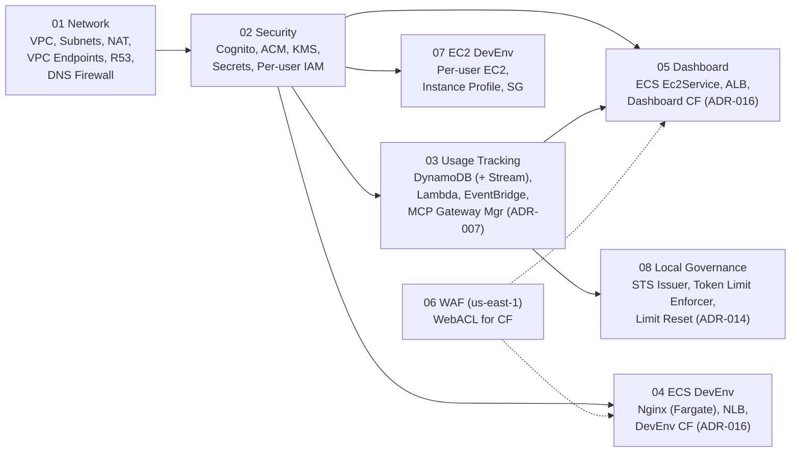

Note: Stack 04 is skipped when `--context governanceOnly=true` (ADR-014 Local Governance Mode).

## Department MCP Gateway (ADR-007)

2-tier AgentCore Gateway architecture for department-isolated MCP tools.

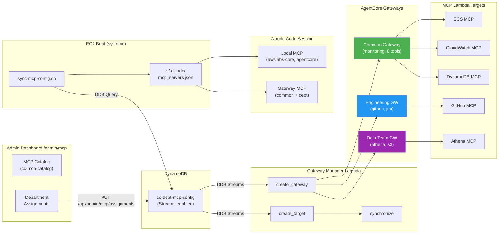

**Security: 3-Layer IAM Isolation**

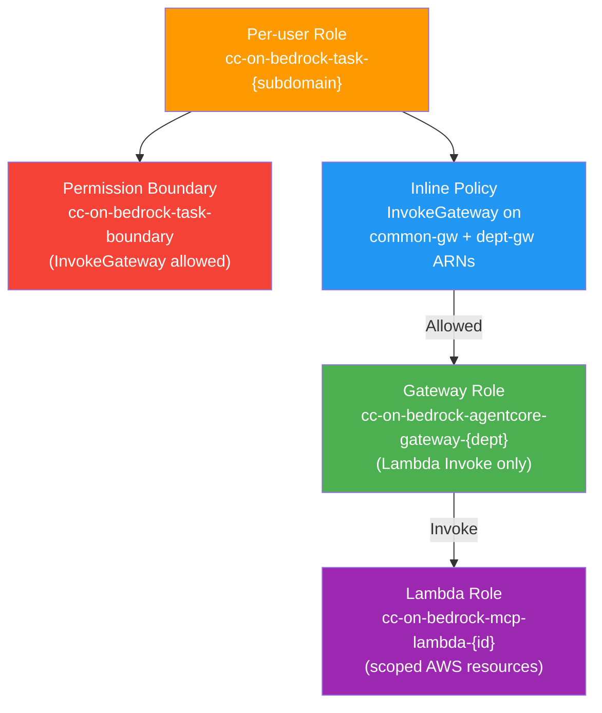

Key resources (Stack 03): `cc-mcp-catalog` DDB, `cc-dept-mcp-config` DDB (Streams), `gateway-manager` Lambda

## User Access Flow

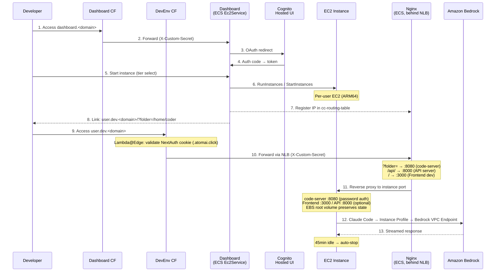

## EC2 Instance Lifecycle (ADR-010: Hibernation)

EC2 Hibernation enables ~5s resume (vs 30-60s cold start) by saving RAM to encrypted EBS.

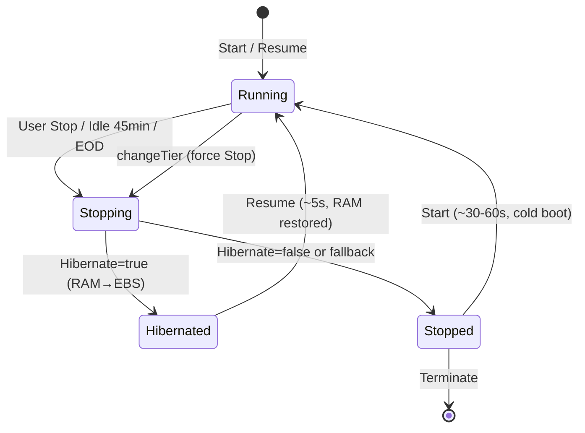

Key behaviors:
- **Feature flag** (`HIBERNATE_ENABLED`): per-instance capability check via `HibernationOptions.Configured`
- **Graceful fallback**: hibernate failure → automatic regular Stop
- **changeTier/switchOs**: always uses regular Stop (instance type change requires cold restart)
- **60-day limit**: rotation Lambda auto-restarts instances approaching AWS maximum

## Bedrock Access (Direct Mode)

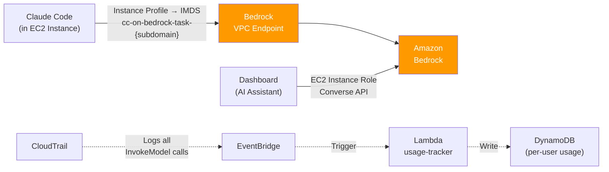

## Local Governance Mode (ADR-014)

EC2 DevEnv 없이 거버넌스만 가져가는 배포 프로파일. 사용자는 로컬 PC에서 Claude Code를 실행하고, 대시보드는 Cognito 로그인 후 단기 STS 자격증명을 발급한다.

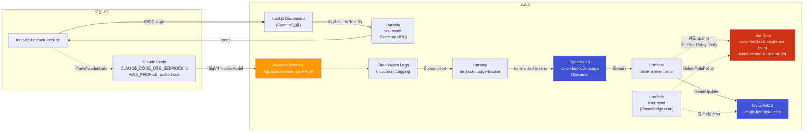

**핵심 거버넌스 메커니즘**:
- **합산 normalized token 한도** (Opus 1.0 / Sonnet 0.2 / Haiku 0.053 가중치)
- 사용자 AND 부서 한도 (AND 조건, period = daily/weekly/monthly)
- 한도 도달 시 user role에 IAM Deny policy 동적 부착 — IAM은 호출 시점 평가이므로 8h 세션 중에도 즉시 차단
- 차단 latency 1-3분 (Invocation Logging 지연이 하한, ADR-014 Limitations)
- backup path: 기존 `budget-check.py`(5분 cycle)가 Stream 실패 대비

**배포 프로파일**:
- `cdk deploy --all --context governanceOnly=true` → EC2/ECS DevEnv 스택 skip
- 거버넌스 인프라(Usage Tracking, Limits, Dashboard)만 배포
- EC2 모드와 공존 가능(둘 다 deploy해서 사용자가 선택). 사용량 attribute는 role prefix로 구분 (`task-` vs `local-user-`)

## Network Layout

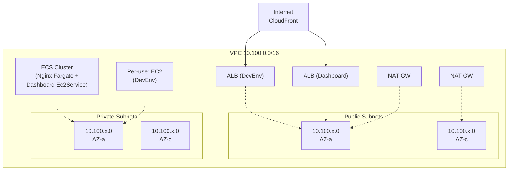

## DLP Security Policies

> See [ADR-005](decisions/ADR-005-security-policy-access-control.md) for the full decision record (DLP + IAM Policy Set + approval workflow).

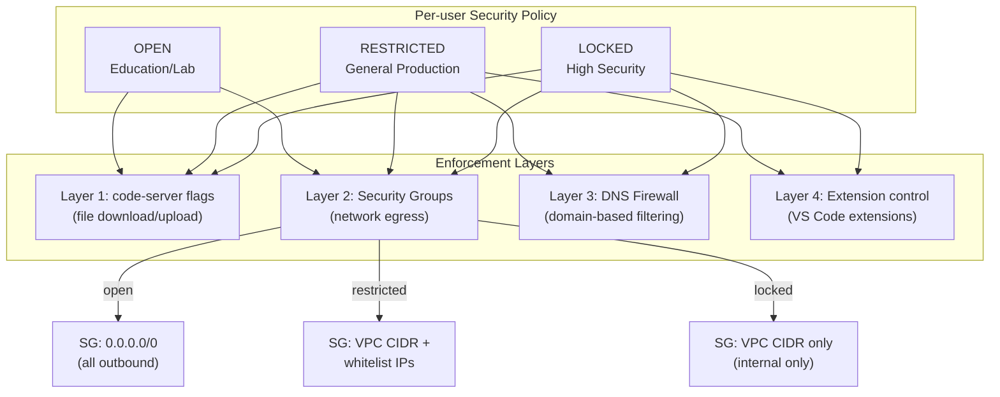

## IAM Policy Set & Approval Workflow (Proposed)

> Designed but not yet implemented. See [ADR-005](decisions/ADR-005-security-policy-access-control.md).

- **Per-user IAM Role**: `cc-on-bedrock-task-{subdomain}` — Permission Boundary로 최대 권한 범위 제한
- **Pre-defined Policy Set Catalog**: DynamoDB, S3, EKS, SQS, SNS, Secrets Manager 등 8종
- **Approval Workflow**: User 신청 → DynamoDB `cc-approval-requests` → Admin 승인 → 자동 적용
  - `tier_change`: Cognito attribute + EC2 instance type 변경
  - `dlp_change`: Cognito attribute + Security Group swap (실행 중 즉시 적용)
  - `iam_extension`: `PutRolePolicy` on per-user role + EventBridge 기반 자동 만료

## Usage Tracking & Budget Enforcement

> See [ADR-006](decisions/ADR-006-department-budget-management.md) for department budget management decision.
> See [ADR-014](decisions/ADR-014-local-governance-mode.md) for normalized token limit enforcement (Local Governance Mode).

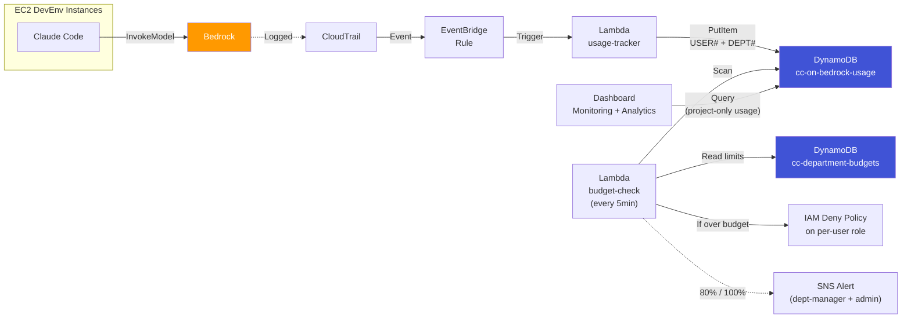

**Dashboard Metrics Source**: Monitoring page의 Bedrock 사용량 메트릭은 DynamoDB `cc-on-bedrock-usage` 테이블에서 조회. CloudWatch `AWS/Bedrock` namespace는 계정 전체 사용량이므로 사용하지 않음 — DynamoDB 파이프라인이 `cc-on-bedrock-task-*` IAM role prefix로 3중 필터링하여 프로젝트 전용 데이터만 기록.

**CloudWatch Cost Optimization**: `textDataDeliveryEnabled: false` on Bedrock invocation logging — disables full request/response text delivery, keeping only metadata (model ID, token counts, latency). Reduces CloudWatch Logs cost by ~99% while preserving all data needed for usage tracking and budget enforcement.
